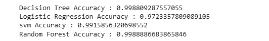
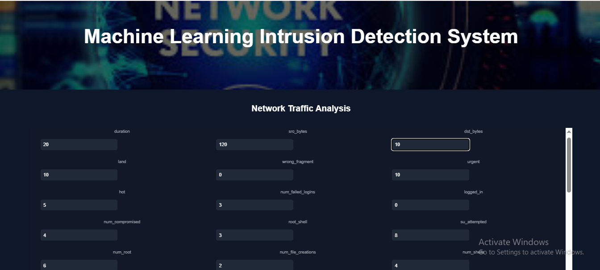

# Machine Learning Intrusion Detection System

A web-based Intrusion Detection System built using Machine Learning and Flask.

## Dataset
Dataset: NSL-KDD
Model: Decision Tree (Accuracy ~99.87%)
Framework: Flask

Dataset available at:
https://www.kaggle.com/datasets/...

## Models Used
- Decision Tree
- Random Forest
- Logistic Regression
- Support Vector Machine

Best Model: Decision Tree (Accuracy: 99.87%)

## Features
- Web interface for network feature input
- Dropdown handling for protocol, service, and flag
- Automatic one-hot encoding handling
- Intrusion prediction result page

## Project Workflow
Dataset → Preprocessing → Model Training → Model Saving → Flask Web Application

## Architecute Diagram
User Input
     ↓
Flask Web App
     ↓
Feature Encoding
     ↓
ML Model (Decision Tree)
     ↓
Prediction (Normal / Intrusion)

## Screenshots

### Model Accuracy Comparison

### Web Application Home Page

### Prediction Result
